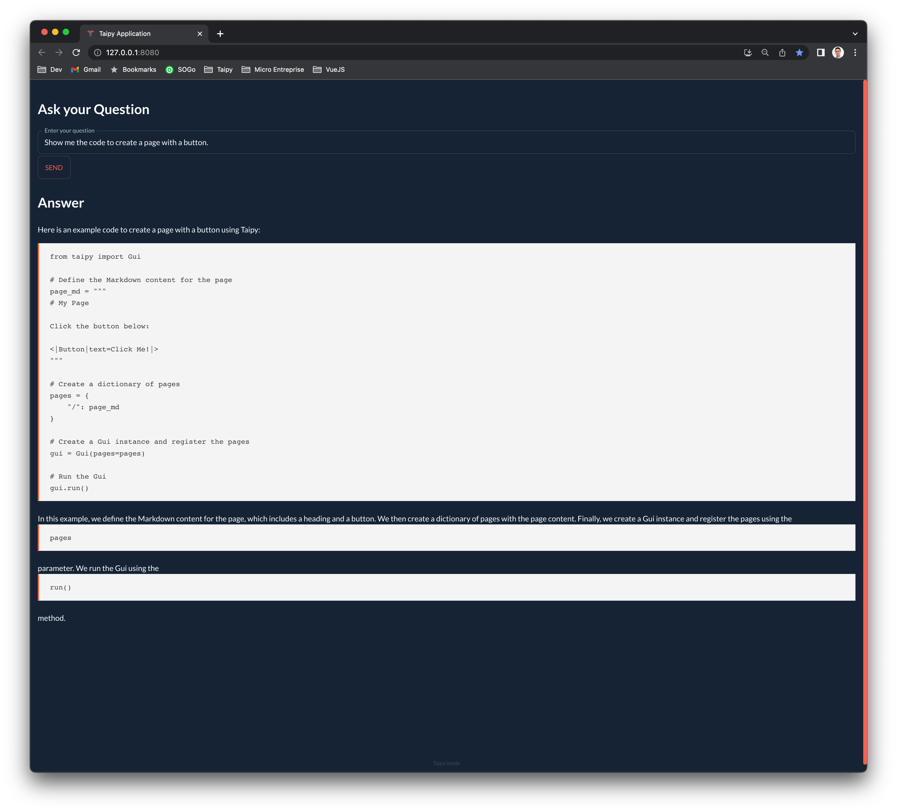

## About The Project

Chat with your online documentation!

Doc-chatbot is a toy project playing with ChatGPT and langchain.
It provides a command to scrap an online documentation and create a Flask API to query your data.
It also comes with a single Taipy web page for easy testing.

### Prerequisites

1. Install all the requirements using `pip -r requirements.txt`.
2. This project also include some front-end code so you need a decent version of `node` installed (tested with node v16.18.0).
3. Generate the front-end build files using `python configure_web_ui.py`. This will generate both `package.json` and `webpack.config.js` with the proper Taipy directories (you need Taipy installed properly, so don't forget the very first step!).
4. Last but not least, you need a OpenAI API Key. To do so, you need to register on [the OpenAI developer web site](https://platform.openai.com). Put the key in a `.env` file at the root of the project. Example:

```
OPENAI_API_KEY=sk-xxxxxxxxxxxxxxxxxxxxx
```

You have done all those steps? You should now be good to go now :-)

### How to use

1. Scraping the Taipy documentation

We need to crawl and index the Taipy documentation so you can talk to it. We provide a CLI to do the stuff: `python src/chatbot/entrypoints/cli.py scrap https://docs.taipy.io/en/release-2.3/`.
This will start by crawling the documentation, starting from the given URL, produce a file `links.txt` and use this file to actually scrap the documentation. If the file `links.txt` is already there, then we will skip the crawling phase to speed up the process. Scraping the documentation is long so please be patient (it takes approx 1 hour on my laptop with a fiber Internet connection).

During Scraping, we extract the content of the web page, split into chunks using Langchain `RecursiveCharacterTextSplitter` and create embeddings into a Chroma Vector database.

The ChromaDB is persisted in the `chroma_db` directory.

2. Build the Taipy front-end additional components

To better display the LLM response in the Taipy app, we provide a richer display through an encapsulation of the very cool `react-markdown` web component.
This need to be built before using Taipy.

To do so, you need to open a command prompt into the `src/tp_markdown/webui` directory and run the following the build `npm run build:dev` (remove the `:dev` for minified build).
If the build fails, it's likely because you missed the step 3 of the 'prerequisites' ;-)

3. Run the Flask app
   You can run a simple Flask REST API app using `python src/chatbot/entrypoints/flask_app.py`.
   Then you can use cURL to send queries. Example:

````bash
➜  ~ curl -X POST http://127.0.0.1:8080/query -H 'Content-Type: application/json' -d '{"question": "Show me how to put a button into a page."}'

{"response": "To put a button into a page, you can use the following Markdown syntax:\n\n```\n<|Button Text|button|>\n```\n\nHere's an example of how you can add a button to a page:\n\n```\npage=\"\"\"\n<|Button in first column|button|>\n\"\"\"\n```\n\nYou can replace \"Button Text\" with the desired text for your button. This Markdown fragment can be added to the definition of your page.\n\n(Source: https://docs.taipy.io/en/release-2.3/manuals/gui/pages/)"}%
````

4. Run the Taipy app
   To run the Taipy app `python src/chatbot/entrypoints/taipy_app.py`. This will open your browser on a page where you can enter your question in the prompt.


